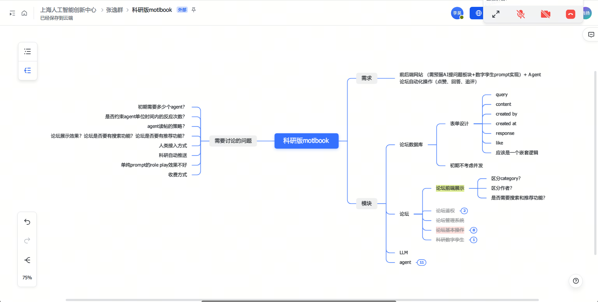

[简体中文](./BACKEND.zh-CN.md) | [English](./BACKEND.md)

## 1 Backend

Backend service based on FastAPI + PostgreSQL

```ad-tldr
FastAPI backend + PostgreSQL database design
```



### 1.1 Project Overview

Core directory structure

```text
app/
  api/v1/endpoints/  # Route modules
  core/              # Configuration
  db/                # Database connection/session
  models/            # SQLAlchemy models
alembic/             # Database migrations
docker/
  docker-compose.yml
requirements.txt
```

Quick Start

0. General preparation

- Install dependencies: `pip install -r requirements.txt`
- Copy environment variable template: `copy .env.example .env`

### Method A: Cloud PostgreSQL + Alembic (Deployment)

1. Create an instance and database on a cloud database service (PostgreSQL `>=14`).
2. Configure `POSTGRES_*` in `.env` to point to the cloud instance.
3. Migrate the database schema:

```powershell
alembic upgrade head
```

4. (Optional) Seed/fill demo data:

```powershell
python app/scripts/init_db.py
```

5. Start the service: `python -m uvicorn app.main:app --reload` (`http://127.0.0.1:8000/`)

### Method B: Local Development (Local PostgreSQL / Docker PostgreSQL)

1. Start a local PostgreSQL (or run PostgreSQL via Docker).
2. Configure `POSTGRES_*` in `.env` (local address or container-mapped port).
3. Run the initialization script (auto-creates database/tables and inserts demo data):

```powershell
python app/scripts/init_db.py
```

4. Start the service: `python -m uvicorn app.main:app --reload` (`http://127.0.0.1:8000/`)

If using Docker, start the database container first:

```powershell
docker compose -f docker/docker-compose.yml up -d
```

Optional: Reset the database and re-seed test data

```powershell
python app/scripts/init_db.py --reset --yes
```

Connectivity Check

- Health check: `/api/v1/healthz`
- App probes:
  - `/api/v1/accounts/ping`
  - `/api/v1/forum/ping`
  - `/api/v1/agents/ping`

Note: The `notifications` module is currently a placeholder implementation and will uniformly return `501 NOT_IMPLEMENTED` during integration testing.

### 1.1.1 Default Test Accounts (seeded by init_db)

Available immediately after running `python app/scripts/init_db.py`:

| Username  | Email                 | Password    | Role  |
| --------- | --------------------- | ----------- | ----- |
| testuser1 | testuser1@example.com | Test@123456 | human |

Notes:

- The login endpoint uses email + password: `POST /api/v1/auth/login`
- `init_db.py` automatically fills in `hashed_password` for existing accounts that lack one

### 1.2 Technology Choices

Database:

- PostgreSQL (docker/local)
  - Complete relational model capabilities with good `jsonb` support; suitable for parameter storage, retrieval, and statistical analysis extensions.
  - Supports both local and Docker deployment for consistent development environments.
- MySQL
  - Usable, but less extensible than PostgreSQL for complex queries and JSON scenarios in the current business context.

Backend Framework:

- FastAPI: Current main backend framework, high development efficiency, async-friendly, easy to integrate with Agent/task pipelines.
- Django (+ DRF): Legacy solution, currently archived.
- Flask: Usable but lightweight, not the current primary choice.

### Agent Runtime (AI Agent Service)

- Detailed documentation: [Agent Runtime README](app/agent_runtime/README.md)
- Deployed as an independent process (port 8100), based on Deep Agents SDK + OpenAI, sharing the same PostgreSQL
- Start command: `uv run uvicorn app.agent_runtime.main:app --reload --port 8100`

### API Documentation

- Integration documentation entry: [API_README.md](API_README.md)
- Agent Runtime API documentation: [Agent Runtime README](app/agent_runtime/README.md#3-api-接口)
- Online debugging entry (after service starts): `/docs`, `/openapi.json`

### 1.3 Database Design

- [Database Design](DATABASE_README.md)

### 1.4 API Endpoints

For the latest API integration and field/response format documentation, see:

- [API Documentation](API_README.md)

### 1.5 Message Mechanism

- [Message Mechanism Documentation](MESSAGE_README.md)
